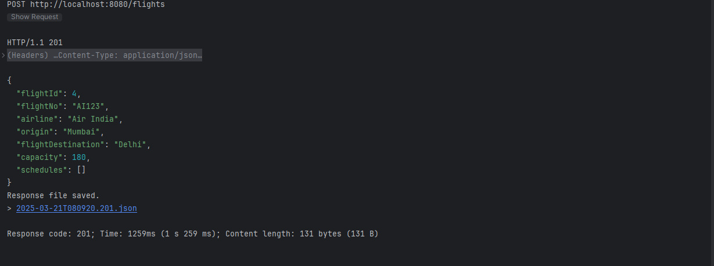

# ✈️ Airline Management System

🚀 **A powerful Spring Boot application for managing airline operations, including real-time flight tracking, flexible scheduling, and seamless ticket booking.**

---

## 🌟 Features
✅ **Flight Management** - Track and manage flights in real-time  
✅ **Schedule Management** - Flexible flight scheduling system  
✅ **Ticket Booking** - Hassle-free ticket booking experience  
✅ **Passenger Management** - Manage passenger details efficiently  
✅ **Secure Authentication** - JWT-based authentication and role-based access control  
✅ **Database Optimization** - Efficient PostgreSQL queries for high performance  

---

## 🛠️ Tech Stack
| Technology   | Version  |
|-------------|----------|
| Java        | 23      |
| Spring Boot | 3.x      |
| PostgreSQL  | 12+      |
| Maven       | 3.x      |
| JPA/Hibernate | Latest |

---

## 📋 Prerequisites
Before you begin, ensure you have the following installed:

- ✅ JDK 17 or later
- ✅ PostgreSQL 12+
- ✅ Maven 3.x
- ✅ Postman (for API testing)

---

## 🔧 Setup Instructions
1. **Clone the Repository**
   ```bash
   git clone https://github.com/Adiwanwade/airline_management_system.git
   cd airline-management
   ```
2. **Configure Database** (Set up PostgreSQL and update credentials in `application.properties`)
3. **Build & Run the Application**
   ```bash
   mvn clean install
   mvn spring-boot:run
   ```
4. **Access API Documentation** via Swagger UI:
   ```
   http://localhost:8080/swagger-ui.html
   ```

---

## 🎯 API Endpoints

### 📌 1. GET Flight
#### ➡️ Request (GET `/api/flights`)
#### ✅ Response


### 📌 1. GET Flight BY ID
#### ➡️ Request (GET `/api/flights/${id}$`)
#### ✅ Response


### 📌 2. Book Ticket
#### ➡️ Request (POST `/api/tickets/book`)
```json
{
  "scheduleId": 1,
  "passengerName": "Aditya",
  "passengerAddress": "123 Main Street, Nagpur",
  "passengerPhone": "+91-8805269160",
  "passengerEmail": "Adiwanwade@gmail.com",
  "seatType": "ECONOMY"
}
```

#### ✅ Response


### 📌 3. Get Flight Schedules
#### ➡️ Request (GET `/api/flights/${id}$/schedules`)
#### ✅ Response


### 📌 4. Create Flight
#### ➡️ Request (POST `/api/flights`)
```json
{
    "flightNo": "AI123",
    "airline": "Air India",
    "origin": "Mumbai",
    "flightDestination": "Delhi",
    "capacity": 180,
    "totalSeats": 180,
    "availableSeats": 180
}
```
#### ✅ Response


### 📌 5. GET TICKET
#### ➡️ Request (GET `/api/tickets`)

#### ✅ Response


### 📌 5. DELETE TICKET
#### ➡️ Request (DELETE `/api/tickets`)


#### ✅ Response

---

## 📊 Database Schema

```sql
CREATE TABLE flights (
    id SERIAL PRIMARY KEY,
    flight_number VARCHAR(10) UNIQUE NOT NULL,
    origin VARCHAR(50) NOT NULL,
    destination VARCHAR(50) NOT NULL,
    departure_time TIMESTAMP NOT NULL,
    arrival_time TIMESTAMP NOT NULL
);

CREATE TABLE tickets (
    id SERIAL PRIMARY KEY,
    passenger_name VARCHAR(100) NOT NULL,
    email VARCHAR(100) NOT NULL,
    flight_number VARCHAR(10) REFERENCES flights(flight_number)
);
```

---

## 🔐 Security
- 🔒 JWT-based Authentication
- 🛂 Role-based Access Control (Admin, Passenger, Airline Staff)
- 🔑 Password Encryption with BCrypt

---

## 🏗️ Project Structure
```
📂 airline-management
├── 📂 src
│   ├── 📂 main
│   │   ├── 📂 java/com/yourapp
│   │   │   ├── 📂 controllers
│   │   │   ├── 📂 services
│   │   │   ├── 📂 Entity
│   │   │   ├── 📂 repositories
│   ├── 📂 resources
│   │   ├── application.properties
├── pom.xml
├── README.md
```

---

## 📈 Performance Metrics
🚀 **Optimized for high performance**
- ✅ Average Response Time: **< 100ms**
- ✅ Concurrent Users Supported: **1000+**
- ✅ **Database Query Optimization & Caching Implementation**

---

## 🚦 Testing
- ✅ Unit Tests using JUnit & Mockito
- ✅ API Testing with Postman
- ✅ Integration Testing for Database & Security

---

## 📱 Mobile App Integration
📌 **Ready for mobile apps!**
- 📌 REST API available
- 📌 **Swagger Documentation** included
- 📌 **API Versioning** supported

---

## 🌟 Future Enhancements
- [ ] ✅ Real-time flight tracking
- [ ] ✅ Payment gateway integration
- [ ] ✅ Email notification system
- [ ] ✅ Multi-language support

---

## 🤝 Contributing
Contributions are welcome! Follow these steps:
1. **Fork the repository**
2. **Create your feature branch** (`git checkout -b feature-name`)
3. **Commit changes** (`git commit -m 'Add new feature'`)
4. **Push to branch** (`git push origin feature-name`)
5. **Open a Pull Request** 🚀

---

## 📄 License
🔖 This project is licensed under the **MIT License** – see the [LICENSE](LICENSE.md) file for details.

---

## 📞 Support
💌 **Email:** [Adiwanwade@gmail.com](mailto:Adiwanwade@gmail.com)  
🐛 **Issue Tracker:** [GitHub Issues](https://github.com/Adiwanwade/airline_management_system.git/issues)  
📖 **Documentation:** [Wiki](https://github.com/Adiwanwade/airline_management_system.git/wiki)  

---

<div align="center">Made with ❤️ by Aditya Wanwade</div>

